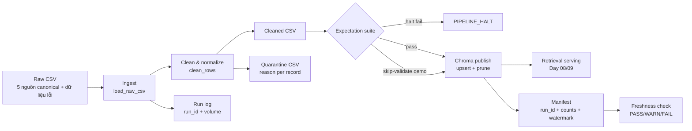

# Kiến trúc pipeline - Lab Day 10

**Nhóm:** Điền trước khi nộp
**Cập nhật:** 2026-06-10

## 1. Sơ đồ luồng

Điểm đo freshness là `latest_exported_at` trong manifest. `run_id` được ghi
ngay khi ingest bắt đầu, sau đó xuất hiện trong log, metadata Chroma và
manifest để truy vết cùng một lần chạy.

## 2. Ranh giới trách nhiệm

| Thành phần | Input | Output | Owner |
|---|---|---|---|
| Ingest | `data/raw/policy_export_dirty.csv` | Danh sách record thô, `raw_records` | Ingestion Owner |
| Transform | Record thô + data contract | Cleaned rows và quarantine có `reason` | Cleaning Owner |
| Quality | Cleaned rows | Danh sách expectation, quyết định halt | Quality Owner |
| Embed | Cleaned CSV | Snapshot collection `day10_kb` | Embed Owner |
| Monitor | Manifest + SLA 24 giờ | PASS/WARN/FAIL và chi tiết age | Monitoring Owner |

## 3. Idempotency và rerun

`chunk_id` là SHA-256 rút gọn của `doc_id` và nội dung đã chuẩn hóa. ID không
phụ thuộc vị trí record trong CSV, vì vậy đổi thứ tự input không tạo vector
mới. Mỗi publish dùng `upsert`; trước upsert, pipeline lấy danh sách ID đang
có và xóa các ID không còn thuộc snapshot cleaned hiện tại.

Run `step5-inject-bad-v2` thay một vector refund sạch bằng vector stale. Run
`step5-restored-good` ghi `embed_prune_removed=1`, sau đó collection trở lại
34 vector. Đây là bằng chứng snapshot không phình sau rerun và dữ liệu cũ
không tiếp tục xuất hiện trong top-k.

## 4. Retrieval serving

`eval_retrieval.py` và `grading_run.py` dùng cùng collection với biến môi
trường `CHROMA_DB_PATH`, `CHROMA_COLLECTION` và `EMBEDDING_MODEL`. Vector
search lấy tập ứng viên, sau đó `retrieval.py` rerank theo độ phủ token Unicode.
Reranker không đọc ID câu hỏi, expected document hoặc keyword chấm điểm.

Day 09 có thể dùng lại collection này bằng cách trỏ cùng các biến môi trường.
Mặc định Day 10 dùng collection riêng `day10_kb` để không ghi đè corpus đang
phục vụ agent khác trước khi expectation pass.

## 5. Rủi ro đã biết

- Snapshot mẫu có watermark ngày 2026-04-10 nên freshness FAIL với SLA 24 giờ.
- SentenceTransformers lần đầu cần tải model nếu máy chưa có cache.
- `--skip-validate` có thể publish dữ liệu xấu và chỉ được dùng cho demo inject.
- Alias lexical trong hybrid retrieval cần được mở rộng khi domain có thuật
  ngữ mới, nhưng không được thêm đáp án cụ thể của bộ grading.
